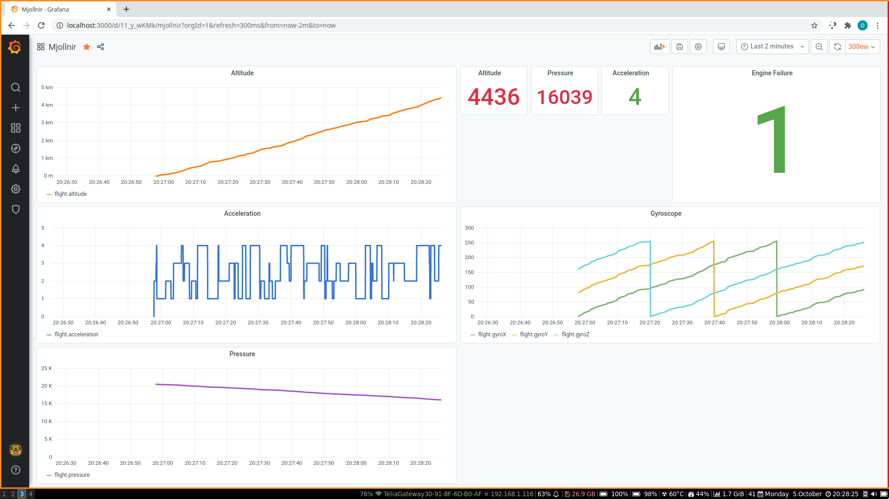

# Mjollnir Grafana Test
This repository contains a potential dashboard for the rocket Mjollnir by AESIR at KTH.
It uses Grafana and InfluxDB

## prerequisites
Install python dependencies (and python)\
`python -m pip install -r requirements.txt`

The serial dummy uses platformio.

#### linux only
Install InfluxDB and Grafana through your package manager.

### programming the teensy
Cd to the dummy-serial directory and run `platformio run -t upload`.
It should run on any board if you change the board in `platformio.ini`

## How to run
### Windows 
Plug in the Teensy, run `run.bat` and hope for the best. The script assumes that python is in `PATH`, if not, just run `serial-reader/main.py` manually.

### linux
plug in the Teensy
run `influxd`\
run `./run_grafana.sh`\
run `python serial-reader/main.py`\
in that order

## How to use

Go to `localhost:3000` in your browser and login as `admin` with the password `aesir`.
Under dashboards you can find `Mjollnir` and `Mjollnir (filtered)`. The end result is the same but they differ a little behind the scenes.
The performance starts to degrade after a few minutes as the database grows in size so use the version that you find works best. It works much better in Chromium than in firefox.

Grafana doesn't really have a framerate in the traditional sense. You can configure an update frequency from the upper right drop down menu. You can also configure how far back you want the graphs to go. Change the cut off value to something like `now - 3m` for 3 minutes and `now - 2m` for 2. 